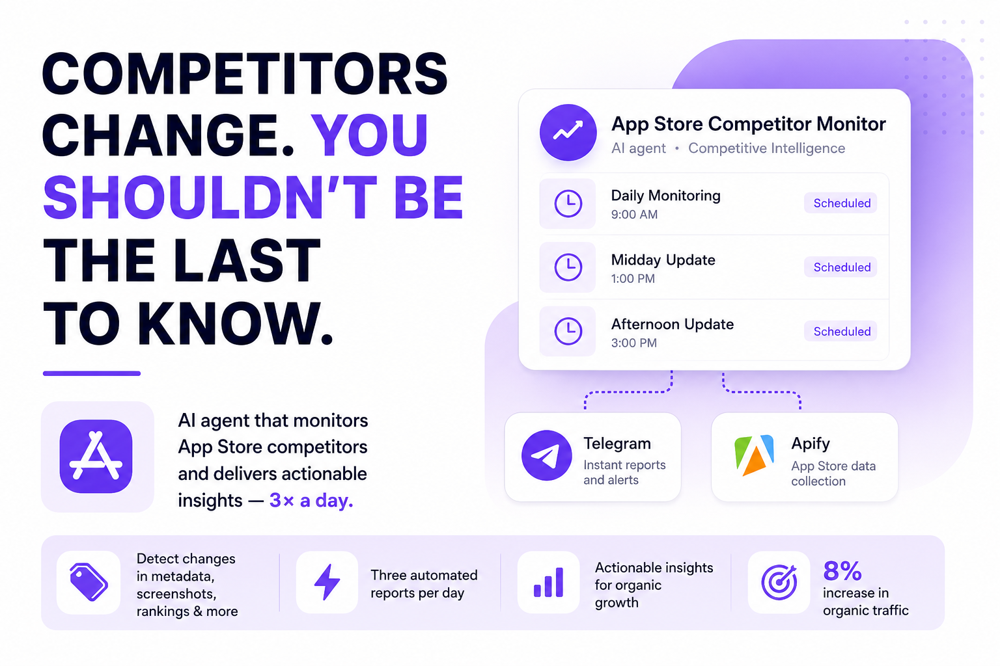
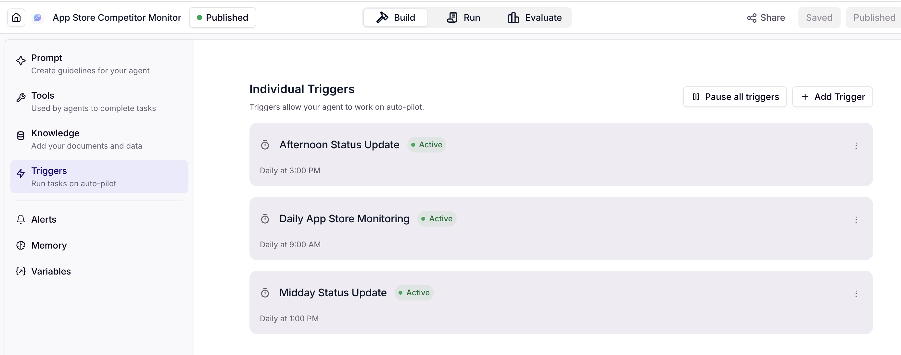
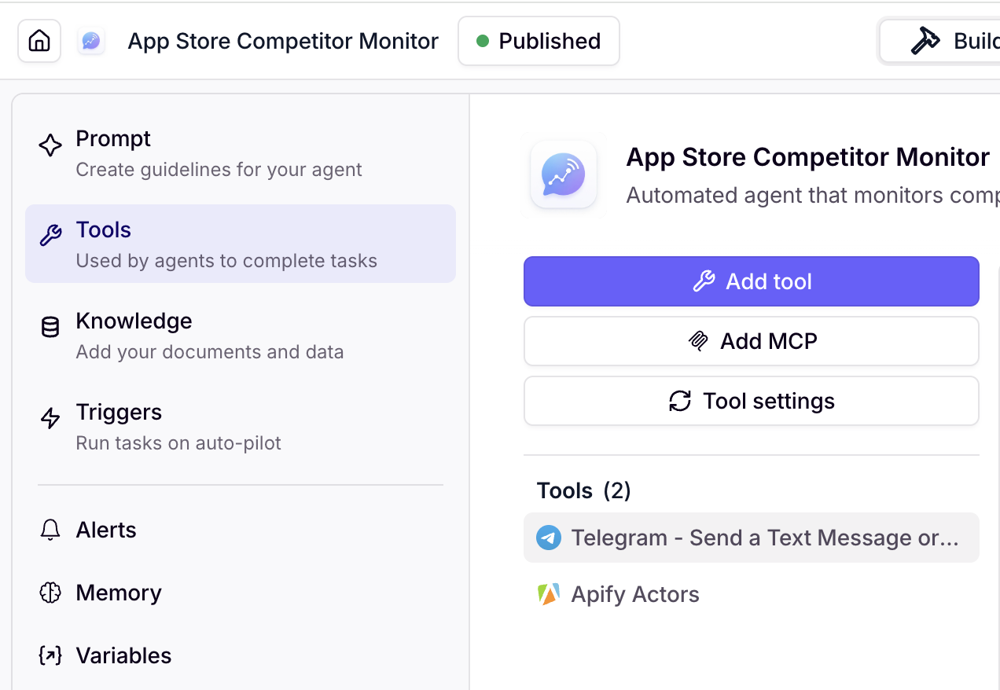

# app-store-competitor-monitor
AI agent that monitors App Store competitors, detects metadata and visual changes, and delivers Telegram reports three times a day.

# App Store Competitor Monitor

An automated AI agent that monitors competitor activity in the iOS App Store, detects meaningful changes, and delivers concise competitive intelligence reports to Telegram three times a day.

I built the first working version in approximately **1.5 days** using [Relevance AI](https://relevanceai.com/) as the agent and orchestration layer, [Apify](https://apify.com/) for App Store data collection, and Telegram for report delivery.

The agent monitored five priority competitors and tracked changes in:

- App Store rankings;
- titles and descriptions;
- keyword-related metadata;
- screenshots and product-page presentation;
- ratings and reviews;
- pricing;
- version updates;
- feature additions.

The insights surfaced by the agent helped inform a marketing response that contributed to an **8% increase in organic traffic**.

> This repository documents an anonymised version of a real production workflow. Competitor names, App Store URLs, Telegram identifiers, credentials, internal reports, and proprietary company data have been removed or replaced with placeholders.



## Why this exists

Mobile marketing data changes quickly.

Competitors continuously experiment with:

- App Store titles and descriptions;
- category and search terms;
- screenshots;
- positioning;
- feature communication;
- pricing;
- product-page conversion strategies.

These changes can affect organic discovery before they become visible in standard performance reports.

I had already noticed competitors periodically changing their App Store positioning and capturing visibility across strategically important searches. However, we had no system that could detect these changes consistently.

Manual monitoring was not sufficient:

- five competitors had to be checked repeatedly;
- important changes could be discovered too late;
- screenshots and metadata had to be compared manually;
- individual observations were difficult to track over time;
- competitor activity could change several times between manual reviews.

I built the App Store Competitor Monitor as an automated early-warning system.

## What it does

The workflow runs automatically three times a day.

Each monitoring cycle:

1. starts from a scheduled Relevance AI trigger;
2. requests current competitor data through an Apify actor;
3. validates the returned App Store information;
4. compares it with previously collected data;
5. identifies meaningful changes;
6. evaluates their potential marketing significance;
7. creates one consolidated report;
8. sends the report to Telegram.

```text
Scheduled trigger
        ↓
Relevance AI agent
        ↓
Apify App Store scraper
        ↓
Data validation
        ↓
Current vs previous-state comparison
        ↓
Change detection and analysis
        ↓
Telegram report
```

## Monitoring schedule

The production agent used three scheduled triggers:

- **09:00** — Daily App Store Monitoring
- **13:00** — Midday Status Update
- **15:00** — Afternoon Status Update

This cadence provided frequent visibility without scraping the App Store too aggressively.



## Data collection

The Relevance AI agent used Apify actors to retrieve App Store information for five selected competitors.

For each app, the workflow attempted to collect:

### Basic information

- app name;
- developer;
- category;
- price;
- App Store URL.

### Metadata

- title;
- description;
- keyword-related changes;
- version number;
- release date.

### Visual assets

- screenshot URLs;
- changes to the screenshot set;
- changes to product-page presentation.

### Performance indicators

- rating;
- review count;
- ranking position.

### Additional product information

- pricing changes;
- in-app purchase information;
- compatibility;
- file size;
- feature or version updates.

The public repository does not include the actual competitor list.

```json
[
  {
    "label": "Competitor A",
    "app_store_url": "{{COMPETITOR_A_URL}}",
    "market": "US",
    "priority": "high"
  },
  {
    "label": "Competitor B",
    "app_store_url": "{{COMPETITOR_B_URL}}",
    "market": "GB",
    "priority": "medium"
  }
]
```

## Change detection

The agent compared the latest App Store data with the previous available snapshot.

It was instructed to identify and categorise changes such as:

- title updates;
- description modifications;
- new screenshots;
- removed or reordered screenshots;
- ranking movement;
- rating and review changes;
- pricing changes;
- version updates;
- new feature communication;
- rebranding;
- changes in category positioning.

Not every difference was treated as strategically meaningful.

The workflow was designed to ignore minor formatting variations and focus on changes that could indicate:

- a new acquisition strategy;
- stronger keyword targeting;
- a product-positioning shift;
- a conversion optimisation test;
- a major product release;
- a rebranding effort;
- a strategic pivot.

## Telegram reports

The agent sent exactly one consolidated Telegram message per monitoring run.

Reports were designed to be:

- written in clear English;
- readable on mobile;
- under 1,000 characters;
- focused on meaningful changes;
- free from technical data dumps;
- structured around marketing implications;
- linked to the relevant App Store page for manual verification.



### Example report

```text
App Store Competitor Intelligence Report
Date: 14 April 2026

Competitor A

Change type: Title
Impact: High

Details:
The app updated its title and introduced a high-priority category term.
This may improve its visibility across relevant App Store searches.

Before:
{{PREVIOUS_TITLE}}

After:
{{CURRENT_TITLE}}

View app:
{{COMPETITOR_A_URL}}

Detected:
10:06 GMT+3


Competitor B

Change type: Screenshots
Impact: Medium

Details:
The app updated its screenshot set, potentially testing new positioning
or messaging to improve product-page conversion.

View app:
{{COMPETITOR_B_URL}}

Detected:
11:26 GMT+3
```

This example is synthetic and does not contain production competitor data.

## The most difficult part

Building the agent and Telegram reporting logic was relatively fast.

The main technical challenge was collecting App Store data reliably.

Apple's ecosystem is relatively closed, and several scraping configurations were blocked or failed during repeated monitoring. I tested multiple Apify actors and adjusted the execution settings until the workflow became sufficiently stable.

The final approach prioritised reliability over maximum collection speed.

### Scraper configuration

The workflow used:

- a primary App Store-specific Apify actor;
- a backup actor when the primary one failed;
- a minimum memory allocation of 1 GB;
- a five-minute execution timeout;
- retries for failed requests;
- delays between repeated attempts;
- independent processing for every app;
- partial-success handling.

### Request pacing

To avoid bot-like behaviour, I configured the agent to:

- process competitors in smaller batches;
- wait between individual scraping requests;
- stagger collection across the monitoring session;
- increase delays after repeated failures;
- retry failed apps after processing the remaining list;
- avoid restarting the entire workflow when one app failed.

This was necessary because the fastest collection configuration was also the least reliable.

## Reliability and failure recovery

The agent was built to continue operating even when some data could not be collected.

### When one app failed

The workflow:

1. continued processing the remaining competitors;
2. recorded the failed app;
3. retried it at the end of the run;
4. included the failure in the final Telegram report;
5. attempted the app again during the next scheduled cycle.

### When the primary scraper failed

The agent:

1. retried the primary actor;
2. waited between attempts;
3. switched to a backup actor;
4. continued with any successfully collected data;
5. sent a diagnostic message if the backup also failed.

### When all scraping failed

The agent still sent a status message:

```text
App Store monitoring failed on {{DATE}} due to {{REASON}}.
The workflow will retry during the next scheduled run.
Last successful run: {{TIMESTAMP}}.
```

A monitoring run was never allowed to end silently.

## Data validation

Before analysing a competitor, the workflow checked:

- whether the App Store URL was valid;
- whether the market matched the URL;
- whether essential fields were present;
- whether the scraper returned a usable data structure;
- whether the current result could be compared with the previous snapshot;
- whether duplicate or malformed records were present;
- whether a missing field represented a genuine removal or a scraping failure.

Partial data was not automatically interpreted as a competitor change.

For example, a missing screenshot set could indicate either:

- that the competitor removed its screenshots; or
- that the scraper failed to retrieve them.

The agent was instructed to flag the uncertainty rather than invent an explanation.

## The workflow is opinionated about five things

### Changes matter more than static competitor profiles

A traditional competitor report becomes outdated quickly.

The agent focuses on what changed since the previous monitoring cycle.

### Collection speed is less important than reliability

Aggressive scraping increased the likelihood of blocking and incomplete results.

A slower, staggered workflow produced more dependable monitoring.

### One failed app should not stop the entire run

Each competitor was processed independently.

Partial success was more useful than losing a complete monitoring cycle because of one failed request.

### Competitive signals require human interpretation

A title, ranking, or screenshot change is an observation—not a complete explanation.

The agent surfaced the change and suggested its possible relevance. The final marketing interpretation remained with me.

### Intelligence should reach the decision-maker automatically

A dashboard that someone has to remember to open is still partly manual.

Telegram delivery made competitor monitoring part of the daily marketing workflow.

## Agent prompt

The production agent was instructed to act as an App Store competitive intelligence analyst.

Its core mission was to:

- systematically monitor iOS competitors;
- detect changes in their App Store presence;
- assess their possible significance;
- send concise and actionable reports;
- handle scraper failures without losing the full monitoring run.

A sanitised version of the prompt is available in:

```text
prompts/app-store-competitor-agent.md
```

The public prompt replaces:

- real competitor names;
- App Store URLs;
- Telegram chat IDs;
- internal variables;
- production credentials;

with configurable placeholders.

## Tools

### Relevance AI

Used for:

- agent orchestration;
- scheduled triggers;
- workflow instructions;
- tool execution;
- current-versus-previous comparison;
- report generation;
- failure handling;
- Telegram delivery.

### Apify

Used for:

- App Store scraping;
- structured data extraction;
- repeated competitor monitoring;
- fallback collection through alternative actors.

### Telegram

Used for:

- scheduled status reports;
- immediate visibility into detected changes;
- failure notifications;
- direct links for manual verification.

## Result

I built the first working version of the monitoring agent in approximately **1.5 days**.

The system enabled us to detect competitor changes without repeatedly checking five App Store pages manually.

It helped surface a competitive change early enough for the team to investigate and respond. The resulting marketing actions contributed to an **8% increase in organic traffic**.

The agent did not independently produce the traffic increase. Its value was in shortening the distance between:

```text
Competitor change
→ Detection
→ Marketing analysis
→ Response
→ Measurable result
```

## My role

I designed and configured the complete workflow.

My responsibilities included:

- defining the business problem;
- selecting the five priority competitors;
- choosing the monitored signals;
- building the agent in Relevance AI;
- connecting the Apify integration;
- testing multiple App Store scrapers;
- configuring retries, fallbacks, memory, and timeouts;
- adjusting request pacing to improve reliability;
- designing the change-detection instructions;
- creating the Telegram report format;
- configuring three scheduled triggers;
- validating the output;
- interpreting the competitive findings;
- translating findings into marketing actions.

AI automated data collection, comparison, reporting, and delivery.

Strategic interpretation and decision-making remained human-led.

## What this agent does not do

It does not:

- prove that a competitor caused a specific traffic change;
- calculate exactly how much traffic a competitor captured;
- replace attribution or App Store analytics tools;
- make final marketing decisions autonomously;
- monitor every app in the category;
- guarantee uninterrupted App Store access;
- bypass platform security or access restrictions;
- treat every ranking fluctuation as a strategic shift;
- publish production data without human review.

It is an early-warning and competitive intelligence system, not a fully autonomous marketing decision-maker.

## Limitations

### App Store access

Scraping reliability can change when Apple modifies App Store behaviour or anti-automation controls.

Actors and pacing settings may need to be reviewed over time.

### Signal interpretation

A metadata, screenshot, or ranking change shows that something happened.

It does not prove why it happened or what result it produced.

### Monitoring scope

The original system monitored five strategically selected competitors.

It was designed for operational relevance, not exhaustive market coverage.

### Historical context

Change detection becomes more valuable as the workflow accumulates a longer history of competitor snapshots.

### Regional differences

The production workflow included apps from more than one App Store market. Market-specific URLs and product pages had to be handled consistently during collection and comparison.

## Repository structure

```text
app-store-competitor-monitor/
├── README.md
├── LICENSE
├── images/
│   ├── app-store-competitor-monitor.png
│   ├── scheduled-triggers.png
│   └── connected-tools.png
├── prompts/
│   └── app-store-competitor-agent.md
├── architecture/
│   └── workflow.md
├── templates/
│   ├── competitor-config.example.json
│   └── telegram-report-template.md
└── examples/
    └── synthetic-telegram-report.md
```

## Potential extensions

The agent could be expanded to include:

- subtitle monitoring;
- release-note comparisons;
- visual screenshot diffs;
- country-level ranking comparisons;
- review sentiment analysis;
- rating anomalies;
- pricing and in-app purchase tracking;
- configurable competitor lists;
- historical trend dashboards;
- Slack or email delivery;
- alerts triggered only by high-impact changes.

These are possible extensions and were not necessarily part of the original production workflow.

## Privacy and confidentiality

This repository does not include:

- real competitor names;
- production App Store URLs;
- Telegram chat IDs;
- Telegram bot tokens;
- API keys;
- Apify credentials;
- internal dashboards;
- company-confidential metrics;
- private monitoring reports;
- proprietary decision-making documents.

All public examples should remain synthetic or anonymised.

## Skills demonstrated

- AI agent design
- Marketing automation
- Competitive intelligence
- Mobile marketing
- App Store optimisation
- Workflow orchestration
- Web scraping
- Prompt design
- API and tool integration
- Error handling
- Data validation
- Telegram automation
- Organic acquisition
- Rapid prototyping
- Human-in-the-loop decision-making

## Disclaimer

This is an anonymised portfolio case study based on a real AI-first product marketing workflow.

The repository documents the architecture, logic, prompt design, reliability challenges, and business application without exposing proprietary production data.

Built by [Olga Kukushkina](https://www.linkedin.com/in/olga-kukushkina/)
